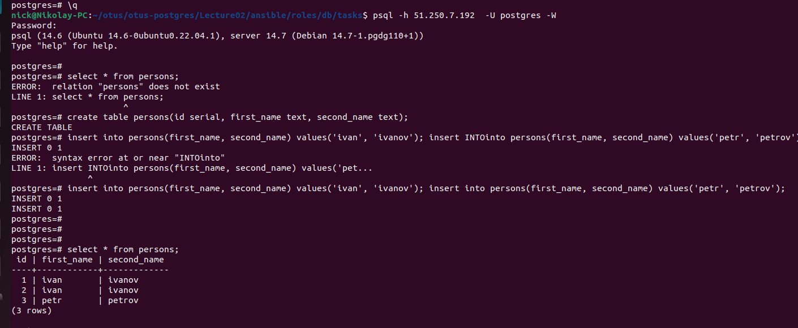

#Домашнее задание к Лекции №3 Установка и настройка PostgteSQL в контейнере Docker


Для развёртывания стенда подготовлены манифесты тераформ в директории тераформ и ansible playbooks в директории ansible. Запуск контейнера производится с помощью docker-compose. Файл compose находится в otus-postgres/Lecture03/ansible/roles/db/files/docker-compose.yml.


Запуск стенда:
```
git clone git@github.com:NickVG/otus-postgres.git
cd otus-postgres/Lecture03/terraform
terraform apply
# Ждём пока стартует VM
sleep 30;
cd ../ansible 
ansible-playbook -i inventory  db.yml
```

Подключаемся к стенду с помощью psql
`psql -h $ip_host_from_inventory  -U postgres -W`

> Создаём таблицу
```
create table persons(id serial, first_name text, second_name text);
CREATE TABLE
postgres=*# insert into persons(first_name, second_name) values('ivan', 'ivanov');
INSERT 0 1
postgres=*# insert into persons(first_name, second_name) values('petr', 'petrov');
INSERT 0 1
postgres=*# commit;
COMMIT
```


Удаляем контейнер через `docker compose down`
И запускаем его заново `docker compose up &`


И уже при старте контейнера видим, что postgres видит базу которая была создана ранее.
Подключившись к базе через psql видим, что все данные остались на месте.

