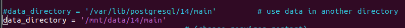

#Домашнее задание к Лекции №6 Установка и настройка PostgreSQL

> Для развёртывания используется vagrant + ansible. Ansible отвечает за установку Зщыепкуы и создание таблицы.

Запуск стенда:
```
git clone git@github.com:NickVG/otus-postgres.git
cd otus-postgres/Lecture06
vagrant up
```

> Подключаемся к первой VM `vagrant ssh server`

> Выключаем СУБД
`sudo -u postgres pg_ctlcluster 14 main stop`

> Создаём файловую систему и вносим запись в `fstab`
```
mkfs.ext4 /dev/sdb
echo '/dev/disk/by-uuid/44c71cb5-dcc5-4ffb-b2fb-2d3d75147cf1  /mnt/data       ext4 defaults 0 0' >> /etc/fstab
mount -a
df -h
```

> Переносим данные и пытаемся запустить кластер обратно. Естественно ничего не выходить, т.к.конфигурация ссылается на старый каталог


> В `/etc/postgresql/14/main/postgresql.conf` меняем параметр `data_directory`




> И запускаем кластер, подключаемся к БД и убеждаемся, что всё хорошо


Задание *

> Отмонтируем диск на первом инстансе и подключаем его ко второму инстансу
> Останавливаем СУБД на втором инстансе, удаляем каталог с БД, монтируем диск с первого инстанса
> запускаем кластер БД и проверям, что всё хорошо.


> Подключаемся к БД второго инстанса и проверяем содержимое таблицы.


