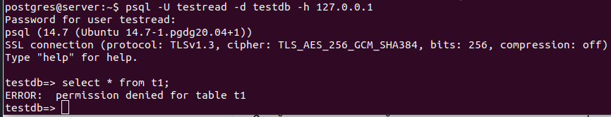
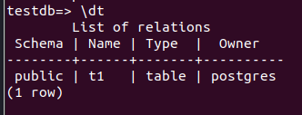
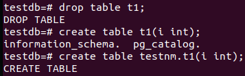
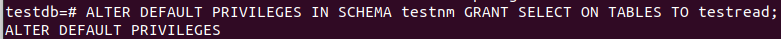
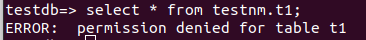
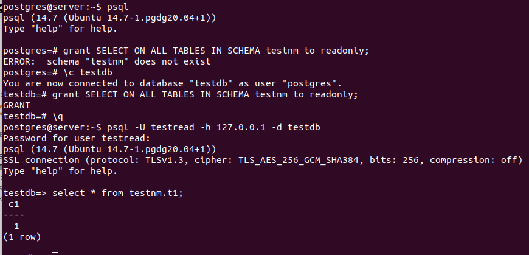
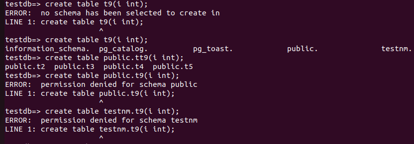

# Домашнее задание к Лекции №7 Работа с базами данных, пользователями и правами

> Для развёртывания используется vagrant + ansible. Ansible отвечает за установку Postgres и создание схемы\таблицы.

Запуск стенда:
```
git clone git@github.com:NickVG/otus-postgres.git
cd otus-postgres/Lecture07
vagrant up
```
Подготовка базы выполняется скриптом, который дёргает ansible

> Подключаемся к VM `vagrant ssh server` и подключемся к СУБД 
```
sudo su - postgres
psql -U testread -d testdb
```  
> Попробуем подключиться к таблице



> Получили ошибку доступа, проверям где находится наша тестовая таблица и видим, что она находится в схеме public
> А всё потому, что `show search_path` покажет `"$user", public` т.е. созданная схема не используется по-умолчанию. Необходимо указывать её при создании объектов.



> Удалим таблицу t1 и создадим её заново, но уже с указанием схемы.



> Создаём новую таблицу с указанем схемы, вставляем строку со значением c1=1
> Заходим под пользователем testread в базу данных testdb и естественно `select * from testnm.t1` выдаст ошибку т.к. выданные ранее права относились к уже созданным объектам. 
> Для того, чтобы права применялись автоматически, потребуется выдать права пользователю на таблицы в схеме по-умолчанию:
```
ALTER DEFAULT PRIVILEGES IN SCHEMA testnm GRANT SELECT ON TABLES TO testread;
```



Возвращаемся к базе, проверям `select * from testnm.t1;` и опять не работает, а почему? А потому что права по умолчанию дали, а на уже созданные объекты прав не выдали. Выдаём:



>  Создаём новые таблицы `create table t2(c1 integer); insert into t2 values (2);`
> Таблицы прекрасно создались т.к. `search_path` никто не менял и от схемы `public` права никто не отбирал



> Решил эту проблему кардинально: `REVOKE ALL ON schema public FROM public;` (т.е. забрал у всех права на создание объектов в public)



> А вот `revoke ALL ON SCHEMA public FROM testread ;` или `revoke ALL ON SCHEMA public FROM readonly ;` почему-то не сработало.


