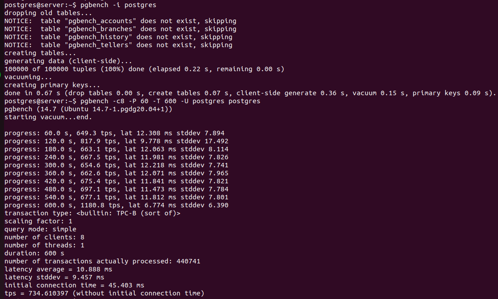
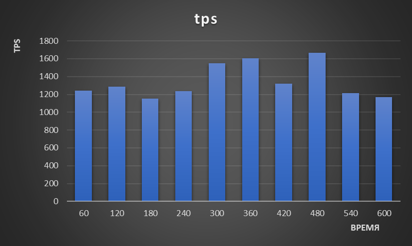
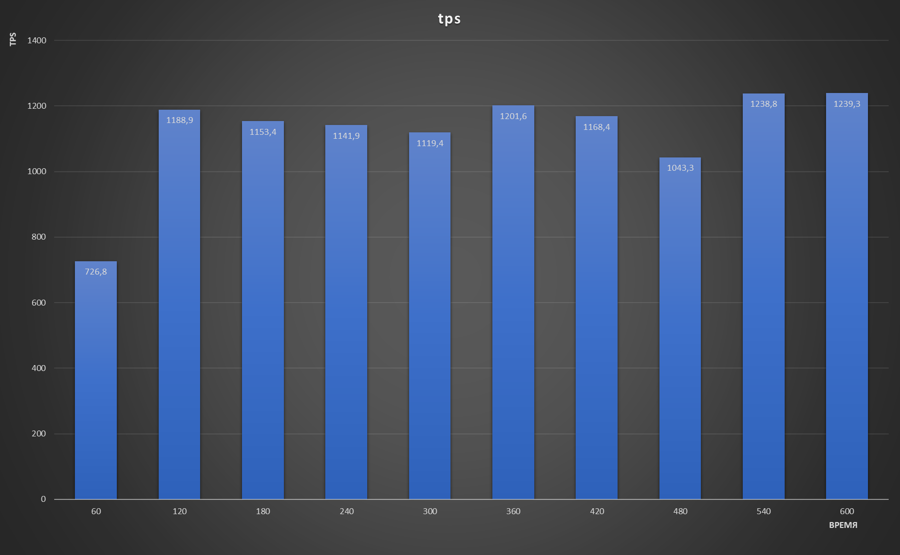

# Домашнее задание к Лекции №8 
### Настройка autovacuum с учетом оптимальной производительности

> Для развёртывания используется vagrant + ansible. Ansible отвечает за установку Postgres и создание схемы\таблицы.

Запуск стенда:
```
git clone git@github.com:NickVG/otus-postgres.git
cd otus-postgres/Lecture08
vagrant up
```
Подготовка базы выполняется скриптом, который дёргает ansible

> Подключаемся к VM `vagrant ssh server`

Проводим подготовку к запуску benchmark: `pgbench -i postgres`. И прогоняем benchmark



После нескольких тестов самые лучшие показатели показали следующие параметры:

```
log_autovacuum_min_duration = 0
autovacuum_max_workers = 1
autovacuum_naptime = 15s
autovacuum_vacuum_threshold = 25
autovacuum_vacuum_scale_factor = 0.05
autovacuum_vacuum_cost_delay = 10
autovacuum_vacuum_cost_limit = 1000
```
В результате...

```
postgres@server:~$ pgbench -c8 -P 60 -T 600 -U postgres postgres
pgbench (14.7 (Ubuntu 14.7-1.pgdg20.04+1))
starting vacuum...end.
progress: 60.0 s, 1240.9 tps, lat 6.377 ms stddev 4.274
progress: 120.0 s, 1286.3 tps, lat 6.162 ms stddev 4.259
progress: 180.0 s, 1153.8 tps, lat 6.872 ms stddev 4.920
progress: 240.0 s, 1235.9 tps, lat 6.408 ms stddev 4.192
progress: 300.0 s, 1547.2 tps, lat 5.116 ms stddev 3.585
progress: 360.0 s, 1606.2 tps, lat 4.934 ms stddev 3.840
progress: 420.0 s, 1322.4 tps, lat 5.983 ms stddev 4.203
progress: 480.0 s, 1668.9 tps, lat 4.745 ms stddev 3.370
progress: 540.0 s, 1211.9 tps, lat 6.536 ms stddev 4.663
progress: 600.0 s, 1169.1 tps, lat 6.776 ms stddev 4.772
transaction type: <builtin: TPC-B (sort of)>
scaling factor: 1
query mode: simple
number of clients: 8
number of threads: 1
duration: 600 s
number of transactions actually processed: 806567
latency average = 5.892 ms
latency stddev = 4.247 ms
initial connection time = 43.191 ms
tps = 1344.281714 (without initial connection time)
```



Эти же параметры дали наиболее ровные показатели:



P.S. На просторах Stackoverflow пишут, что для получения достоверных результатов необходимо прогонять тест минимум 2 часа. Мне кажется это разумным т.к. значения tps могут скакать плюс минус 20-30 процентов дпже при одинковых настройках.

