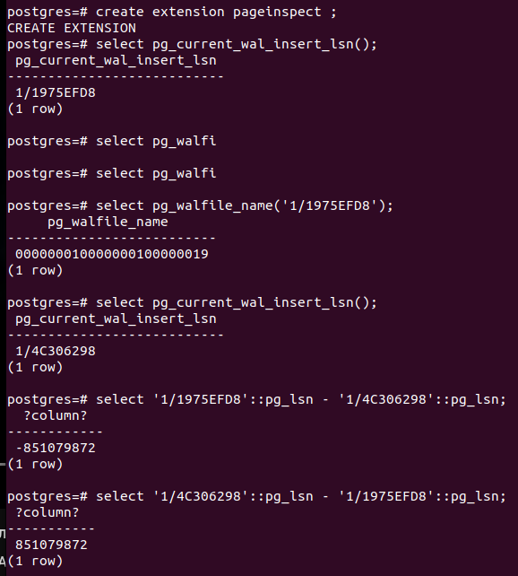

# Домашнее задание к Лекции №9 
### Работа с журналами

##### Пункты 1-4 ДЗ
> Для развёртывания используется vagrant + ansible. Ansible отвечает за установку Postgres и создание схемы\таблицы.

Запуск стенда:
```
git clone git@github.com:NickVG/otus-postgres.git
cd otus-postgres/Lecture09
vagrant up
```
Подготовка базы выполняется скриптом, который дёргает ansible

> Подключаемся к VM `vagrant ssh server`

Т.к. за 10 минут логи перетрутся я добавил параметр `wal_keep_size = 600MB`
Проводим подготовку к запуску benchmark: `pgbench -i postgres`. Сбрасываем статистку с помощью `select pg_stat_reset(); select pg_stat_reset_shared('bgwriter');`. И прогоняем benchmark. После окончания работы  benchmark видно, что размер созданных wal составляет 34x16MB = 544 МБ.
На одну контрольну точку создалось 22:34 = 1,(54) файлов журнала. Или ~24 МБ

Или же, например следующим образом:
```create extension pageinspect ;```


Отличия в разамерах с предыдущими показателями вызваны тем, что измерения показаны для разных прогонов pgbecnh. Во втором прогоне tps был сильно выше и wal файлов было больше 800 МБ.

На первый взгляд checkpoint затрачивалось около 57 секунд. Это видно как из запроса`

```
postgres=# select * from pg_stat_bgwriter \gx
-[ RECORD 1 ]---------+------------------------------
checkpoints_timed     | 608
checkpoints_req       | 0
checkpoint_write_time | 571849
checkpoint_sync_time  | 411
buffers_checkpoint    | 50036
buffers_clean         | 0
maxwritten_clean      | 0
buffers_backend       | 7394
buffers_backend_fsync | 0
buffers_alloc         | 9885
stats_reset           | 2023-03-21 15:32:31.658983+00
```

Так и из следующего запроса (результат аналогичен первому):

```
SELECT
total_checkpoints,
seconds_since_start / total_checkpoints  AS seconds__between_checkpoints
FROM
(SELECT
EXTRACT(EPOCH FROM (now() - pg_postmaster_start_time())) AS seconds_since_start,
(checkpoints_timed+checkpoints_req) AS total_checkpoints
FROM pg_stat_bgwriter
) AS sub;
```

Почему так произошло не понял. Поэтому gроверяем все параметры в соответсвии с этой [статьёй](https://habr.com/ru/company/postgrespro/blog/460423/) и документацией postgres, но не нашёл в чём причина. Скорее у меня подозрение, что из этих 57 требуется вычитать 30(чутьё). 

Поэтому делаем следующее:

```
ALTER SYSTEM SET log_checkpoints = on;
SELECT pg_reload_conf();
```

Затем смотрим в логи postgres я вижу следующее: 

```
2023-03-21 15:50:02.088 UTC [947] LOG:  checkpoint starting: time
2023-03-21 15:50:29.067 UTC [947] LOG:  checkpoint complete: wrote 3307 buffers (2.5%); 0 WAL file(s) added, 0 removed, 1 recycled; write=26.929 s, sync=0.023 s, total=26.979 s; sync files=18, longest=0.004 s, average=0.002 s; distance=29258 kB, estimate=46032 kB
2023-03-21 15:50:32.069 UTC [947] LOG:  checkpoint starting: time
2023-03-21 15:50:59.080 UTC [947] LOG:  checkpoint complete: wrote 1997 buffers (1.5%); 0 WAL file(s) added, 0 removed, 2 recycled; write=26.983 s, sync=0.007 s, total=27.012 s; sync files=9, longest=0.003 s, average=0.001 s; distance=28244 kB, estimate=44253 kB
```

Т.е. checkpoint на моей инсталляции выполняется каждые 30 секунд и длится около 27 секунд, т.е. 0,9 от 30.

Продолжаем изыскания. На глаза попался курс от PostgrePRO на youtube, и в занятии по контрольным точкам есть по-сути похожее задание, только в нём предлагают установить mim_wal_size и max_wal_size в 16МБ. Так сделать не могу т.к. min_wal_size" must be at least twice "wal_segment_size. Поэтому ставим эти нзначения по 32 МБ и прогоняю тест. В рзультате видим кучу ошибок, что checkpoint выполняется слишком часто -> требуется увеличить размер min_wal_size и max_wal_size. `Это в задании имелось ввиду?` :)

##### Пункты 5-6 ДЗ

Запускаем pgbench с `synchronous_commit = on`

```
postgres@server:~$ pgbench -c8 -P 60 -T 600 -U postgres postgres
pgbench (14.7 (Ubuntu 14.7-1.pgdg20.04+1))
starting vacuum...end.
progress: 60.0 s, 1301.9 tps, lat 6.139 ms stddev 7.860
progress: 120.0 s, 2282.1 tps, lat 3.505 ms stddev 2.770
progress: 180.0 s, 2410.8 tps, lat 3.318 ms stddev 2.345
progress: 240.0 s, 1599.0 tps, lat 5.002 ms stddev 6.827
progress: 300.0 s, 1100.4 tps, lat 7.268 ms stddev 10.681
progress: 360.0 s, 1160.4 tps, lat 6.893 ms stddev 9.256
progress: 420.0 s, 1216.8 tps, lat 6.574 ms stddev 9.118
progress: 480.0 s, 2044.2 tps, lat 3.913 ms stddev 2.730
progress: 540.0 s, 1617.2 tps, lat 4.946 ms stddev 5.458
progress: 600.0 s, 1036.2 tps, lat 7.720 ms stddev 11.147
transaction type: <builtin: TPC-B (sort of)>
scaling factor: 1
query mode: simple
number of clients: 8
number of threads: 1
duration: 600 s
number of transactions actually processed: 946146
latency average = 5.072 ms
latency stddev = 6.852 ms
initial connection time = 44.178 ms
tps = 1576.992616 (without initial connection time)
```

Включаем асинхронный режим

```
postgres=# alter system set synchronous_commit = off;
ALTER SYSTEM
postgres=# select pg_reload_conf();
 pg_reload_conf 
----------------
 t
(1 row)
```

И прогоняем pgbench 

```
progress: 60.0 s, 6770.7 tps, lat 1.180 ms stddev 0.799
progress: 120.0 s, 6873.3 tps, lat 1.164 ms stddev 0.551
progress: 180.0 s, 6916.9 tps, lat 1.156 ms stddev 0.978
progress: 240.0 s, 6679.4 tps, lat 1.197 ms stddev 0.726
progress: 300.0 s, 6947.2 tps, lat 1.151 ms stddev 0.656
progress: 360.0 s, 6840.7 tps, lat 1.169 ms stddev 0.762
progress: 420.0 s, 6844.3 tps, lat 1.169 ms stddev 0.643
progress: 480.0 s, 7162.3 tps, lat 1.117 ms stddev 0.556
progress: 540.0 s, 6967.4 tps, lat 1.148 ms stddev 0.525
progress: 600.0 s, 6661.4 tps, lat 1.201 ms stddev 0.657
transaction type: <builtin: TPC-B (sort of)>
scaling factor: 1
query mode: simple
number of clients: 8
number of threads: 1
duration: 600 s
number of transactions actually processed: 4119824
latency average = 1.165 ms
latency stddev = 0.697 ms
initial connection time = 44.111 ms
tps = 6866.754850 (without initial connection time)
```

Видим, что асинхронаая запись получилась где-то в 3-7 раз быстрее, чем синхронная. Почему: по всей видимости pgbench даёт OLTP нагрузку и существеннове время съедает подтверждение записи транзакций на диск. При асинхронной работе мы на эту активность время не тратим, транзакция считается завершённой сразу после логического завершения ещё до записи на диск. Сброс на диск выполняется периодически по расписанию -> `более высокая производительность`.


Включим контрольную сумму страниц: 
```
root@server:/etc/postgresql/14/main# /usr/lib/postgresql/14/bin/pg_checksums -e /var/lib/postgresql/14/main/
Checksum operation completed
Files scanned:  1239
Blocks scanned: 32793
pg_checksums: syncing data directory
pg_checksums: updating control file
Checksums enabled in cluster
```
```
postgres=# show data_checksums;
 data_checksums 
----------------
 on
(1 row)
```

Создаём таблицу
`create table rooms(room_num int, arendator text);`
Добавляем записи в таблицу и останавливаем базу
```
postgres=# insert into rooms values ('1', 'Mendeleev');
INSERT 0 1
postgres=# insert into rooms values ('2', 'Lomonosov');
INSERT 0 1
postgres=# insert into rooms values ('3', 'Zvorykin');
INSERT 0 1
postgres=# select pg_relation_filepath('rooms');
 pg_relation_filepath 
----------------------
 base/13726/33752
(1 row)
postgres=# \q
postgres@server:~$ pg_ctlcluster 14 main stop
```

С помощью  `Vim` меняем `Mendeleev` на `Mendel00v`. Запускаем кластер.

```
postgres=# select * from rooms ;
WARNING:  page verification failed, calculated checksum 27574 but expected 3916
ERROR:  invalid page in block 0 of relation base/13726/33752
```

Очевидно, что checksum не сходится. Для того, точбы вытащить данные выполняем:

```
postgres=# set ignore_checksum_failure = on;
SET
postgres=# select * from rooms ;
WARNING:  page verification failed, calculated checksum 27574 but expected 3916
 room_num | arendator 
----------+-----------
        1 | Mendel00v
        2 | Lomonosov
        3 | Zvorykin
(3 rows)
```
> Success!
