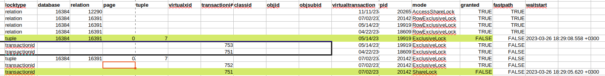

# Домашнее задание к Лекции №10 
### Механизм блокировок

> Для развёртывания используется vagrant + ansible. Ansible отвечает за установку Postgres и создание схемы\таблицы.

Запуск стенда:

```
git clone git@github.com:NickVG/otus-postgres.git
cd otus-postgres/Lecture09
vagrant up
```

Подготовка базы выполняется скриптом, который дёргает ansible

> Подключаемся к VM `vagrant ssh server`

#### Настройте сервер так, чтобы в журнал сообщений сбрасывалась информация о блокировках, удерживаемых более 200 миллисекунд. Воспроизведите ситуацию, при которой в журнале появятся такие сообщения.

```
postgres=# alter system set log_lock_waits to on;
ALTER SYSTEM
alter system set deadlock_timeout to 200;
ALTER SYSTEM
postgres=# select pg_reload_conf();
 pg_reload_conf 
----------------
 t
(1 row)
postgres=# \c testdb 
You are now connected to database "testdb" as user "postgres".
testdb=# \echo :AUTOCOMMIT
off
testdb=# begin;
BEGIN
testdb=*# update rooms SET arendator = 'SYSOEV' where room_num = '1';
UPDATE 2
```

Во втором окне выполняем параллельную транзакцию

```
update rooms SET arendator = 'SYSOEV' where room_num = '1';
```

Которая естественно зависает из-за блокировки. Заканчиваем первую транзакцию, вторая завершается автоматически. Проверяем записи в логе.

```
2023-03-26 15:09:32.418 UTC [18609] postgres@testdb WARNING:  there is already a transaction in progress
2023-03-26 15:10:12.143 UTC [19919] postgres@testdb LOG:  process 19919 still waiting for ShareLock on transaction 749 after 200.671 ms
2023-03-26 15:10:12.143 UTC [19919] postgres@testdb DETAIL:  Process holding the lock: 18609. Wait queue: 19919.
2023-03-26 15:10:12.143 UTC [19919] postgres@testdb CONTEXT:  while updating tuple (0,4) in relation "rooms"
2023-03-26 15:10:12.143 UTC [19919] postgres@testdb STATEMENT:  update rooms SET arendator = 'SYSOEV' where room_num = '1';
2023-03-26 15:10:47.813 UTC [19919] postgres@testdb LOG:  process 19919 acquired ShareLock on transaction 749 after 35870.217 ms
2023-03-26 15:10:47.813 UTC [19919] postgres@testdb CONTEXT:  while updating tuple (0,4) in relation "rooms"
2023-03-26 15:10:47.813 UTC [19919] postgres@testdb STATEMENT:  update rooms SET arendator = 'SYSOEV' where room_num = '1';
```

#### Смоделируйте ситуацию обновления одной и той же строки тремя командами UPDATE в разных сеансах. Изучите возникшие блокировки в представлении pg_locks и убедитесь, что все они понятны. Пришлите список блокировок и объясните, что значит каждая.

Начинаем три update. 

```
update rooms SET arendator = 'SYSOEV' where room_num = '1';
update rooms SET arendator = 'SYSOEV2' where room_num = '1';
update rooms SET arendator = 'SYSOEV3' where room_num = '1';
```

PIDы: 18609, 19919, 20142

Смотрим, что находится в pg_locks:

```
testdb=# SELECT locktype, relation::REGCLASS, mode, granted, pid, pg_blocking_pids(pid) AS wait_for
FROM pg_locks WHERE relation = 'rooms'::regclass order by pid;
 relation | rooms    | RowExclusiveLock | t       | 18609 | {}
 relation | rooms    | RowExclusiveLock | t       | 19919 | {18609}
 tuple    | rooms    | ExclusiveLock    | t       | 19919 | {18609}
 relation | rooms    | RowExclusiveLock | t       | 20142 | {19919}
 tuple    | rooms    | ExclusiveLock    | f       | 20142 | {19919}
```
Видим, что:

> PID 18609 захватил блокировку отношений (locktype relation) `(режим блокировки RowExclusiveLock)` в `rooms` и не блокируется никем.
> PID 19919 успешно пытается выполнить блокировку отношений (locktype relation)  `(режим блокировки RowExclusiveLock)` в `rooms`, зависит от PID 18609.
> PID 19919 успешно пытается выполнить блокировку версии строки(tuple) `(режим блокировки ExclusiveLock)` в `rooms`, но блокируется PID 18609. tuple используется для Блокировка версии строки. Используется в некоторых случаях для установки приоритета среди нескольких транзакций, ожидающих блокировку одной и той же строки. Т.е. этот PID имеет приоритет перед PID 20142
> PID 20142 успешно пытается выполнить блокировку отношений (locktype relation)  `(режим блокировки RowExclusiveLock)` в `rooms`, зависит от PID 19919.
> PID 20142 _не успешно_ пытается выполнить блокировку версии строки(tuple) `(режим блокировки ExclusiveLock)` в `rooms`, но блокируется PID 18919. Неуспешно - потому что, Exclusive совместим лишь с блокировками Acess Share


> Если использовать полный вывод pg_locks (`select from pg_locks`), то увидим, что для PID 19919 не разрешена блокировка transaction_id в режиме share_lock. Т.е. процесс 20142 видит, что транзакция 751 (PID 18609) и ожидает её. Во время ожидания процесс запрашивает разделяемую блокировку для идентификатора этой транзакции (виртуального или постоянного, в зависимости от ситуации). Запрос будет выполнен, только когда другая транзакция завершится и освободит свои блокировки.

#### Воспроизведите взаимоблокировку трех транзакций. Можно ли разобраться в ситуации постфактум, изучая журнал сообщений

Ниже таблица жильцов  нумеров.

```
testdb=# select * from rooms;
 room_num | arendator | seq_num 
----------+-----------+---------
        3 | Zvorykin  |       1
        2 | KOROLEV   |       2
        1 | SYSOEV3   |       3
(3 rows)
```

Представим, что три клерка решили перепланировать заселение жильцов

```
Первый клерк
testdb=# begin;
BEGIN
testdb=*# update rooms set room_num = room_num + 4 where arendator = 'Mendeleev';
UPDATE 1
```

```
Второй клерк
testdb=# begin ;
BEGIN
testdb=*# update rooms set room_num = room_num + 4 where arendator = 'Zvorykin';
```

```
Третий клерк
testdb=# begin;
BEGIN
testdb=*# update rooms set room_num = room_num + 4 where arendator = 'KOROLEV';
UPDATE 1
```

Затем вторая очередь:

```
Первый клерк
testdb=*# update rooms set room_num = room_num + 5 where arendator = 'Zvorykin';
UPDATE 1
```

```
Третий клерк
testdb=*# update rooms set room_num = room_num + 40 where arendator = 'Mendeleev';
```


```
Второй клерк
testdb=*# update rooms set room_num = room_num + 5 where arendator = 'KOROLEV';
ERROR:  deadlock detected
DETAIL:  Process 2034 waits for ShareLock on transaction 774; blocked by process 2035.
Process 2035 waits for ShareLock on transaction 772; blocked by process 2021.
Process 2021 waits for ShareLock on transaction 773; blocked by process 2034.
HINT:  See server log for query details.
CONTEXT:  while updating tuple (0,2) in relation "rooms"
```


После `COMMIT` первая сессия успешно применяется, треться успешно применяется. Вторая сессия после `COMMIT` делает `ROLLBACK`

В логах сервера видна ошибка deadlock

```
2023-03-27 12:04:15.850 UTC [2021] postgres@testdb LOG:  process 2021 still waiting for ShareLock on transaction 773 after 200.317 ms
2023-03-27 12:04:15.850 UTC [2021] postgres@testdb DETAIL:  Process holding the lock: 2034. Wait queue: 2021.
2023-03-27 12:04:15.850 UTC [2021] postgres@testdb CONTEXT:  while updating tuple (0,1) in relation "rooms"
2023-03-27 12:04:15.850 UTC [2021] postgres@testdb STATEMENT:  update rooms set room_num = room_num + 5 where arendator = 'Zvorykin';
2023-03-27 12:05:29.865 UTC [2035] postgres@testdb LOG:  process 2035 still waiting for ShareLock on transaction 772 after 206.561 ms
2023-03-27 12:05:29.865 UTC [2035] postgres@testdb DETAIL:  Process holding the lock: 2021. Wait queue: 2035.
2023-03-27 12:05:29.865 UTC [2035] postgres@testdb CONTEXT:  while updating tuple (0,10) in relation "rooms"
2023-03-27 12:05:29.865 UTC [2035] postgres@testdb STATEMENT:  update rooms set room_num = room_num + 40 where arendator = 'Mendeleev';
2023-03-27 12:05:35.805 UTC [2034] postgres@testdb LOG:  process 2034 detected deadlock while waiting for ShareLock on transaction 774 after 200.255 ms
2023-03-27 12:05:35.805 UTC [2034] postgres@testdb DETAIL:  Process holding the lock: 2035. Wait queue: .
2023-03-27 12:05:35.805 UTC [2034] postgres@testdb CONTEXT:  while updating tuple (0,2) in relation "rooms"
2023-03-27 12:05:35.805 UTC [2034] postgres@testdb STATEMENT:  update rooms set room_num = room_num + 5 where arendator = 'KOROLEV';
2023-03-27 12:05:35.805 UTC [2034] postgres@testdb ERROR:  deadlock detected
2023-03-27 12:05:35.805 UTC [2034] postgres@testdb DETAIL:  Process 2034 waits for ShareLock on transaction 774; blocked by process 2035.
        Process 2035 waits for ShareLock on transaction 772; blocked by process 2021.
        Process 2021 waits for ShareLock on transaction 773; blocked by process 2034.
        Process 2034: update rooms set room_num = room_num + 5 where arendator = 'KOROLEV';
        Process 2035: update rooms set room_num = room_num + 40 where arendator = 'Mendeleev';
        Process 2021: update rooms set room_num = room_num + 5 where arendator = 'Zvorykin';
2023-03-27 12:05:35.805 UTC [2034] postgres@testdb HINT:  See server log for query details.
2023-03-27 12:05:35.805 UTC [2034] postgres@testdb CONTEXT:  while updating tuple (0,2) in relation "rooms"
2023-03-27 12:05:35.805 UTC [2034] postgres@testdb STATEMENT:  update rooms set room_num = room_num + 5 where arendator = 'KOROLEV';
2023-03-27 12:05:35.805 UTC [2021] postgres@testdb LOG:  process 2021 acquired ShareLock on transaction 773 after 80155.576 ms
2023-03-27 12:05:35.805 UTC [2021] postgres@testdb CONTEXT:  while updating tuple (0,1) in relation "rooms"
2023-03-27 12:05:35.805 UTC [2021] postgres@testdb STATEMENT:  update rooms set room_num = room_num + 5 where arendator = 'Zvorykin';
2023-03-27 12:09:27.538 UTC [2035] postgres@testdb LOG:  process 2035 acquired ShareLock on transaction 772 after 237879.778 ms
2023-03-27 12:09:27.538 UTC [2035] postgres@testdb CONTEXT:  while updating tuple (0,10) in relation "rooms"
2023-03-27 12:09:27.538 UTC [2035] postgres@testdb STATEMENT:  update rooms set room_num = room_num + 40 where arendator = 'Mendeleev';
```

#### Могут ли две транзакции, выполняющие единственную команду UPDATE одной и той же таблицы (без where), заблокировать друг друга?

Несмотря на подсказку, что такая ситуция возможна в виде задания со *, я не могу придумать как две последовательные транзакции без дополнительных условий могут заблокировать друг друга. Как по мне, так в таком случае должна нарушаться Изолрирванность (ACID)


P.S. Подсказка для себя на будущее для просмотра блокировок

```
select * from pg_locks;
select pg_blocking_pids(1953);
select * from pg_stat_activity where pid = any(pg_blocking_pids(1953)) \gx
```

```
testdb=# ALTER TABLE rooms ADD COLUMN seq_num SERIAL PRIMARY KEY;
ALTER TABLE
testdb=# create extension pageinspect ;
CREATE EXTENSION
testdb=# CREATE VIEW rooms_view AS
SELECT '(0,'||lp||')' AS ctid,
       t_xmax as xmax,
       CASE WHEN (t_infomask & 128) > 0   THEN 't' END AS lock_only,
       CASE WHEN (t_infomask & 4096) > 0  THEN 't' END AS is_multi,
       CASE WHEN (t_infomask2 & 8192) > 0 THEN 't' END AS keys_upd,
       CASE WHEN (t_infomask & 16) > 0 THEN 't' END AS keyshr_lock,
       CASE WHEN (t_infomask & 16+64) = 16+64 THEN 't' END AS shr_lock
FROM heap_page_items(get_raw_page('rooms',0))
ORDER BY lp;
CREATE VIEW
```
